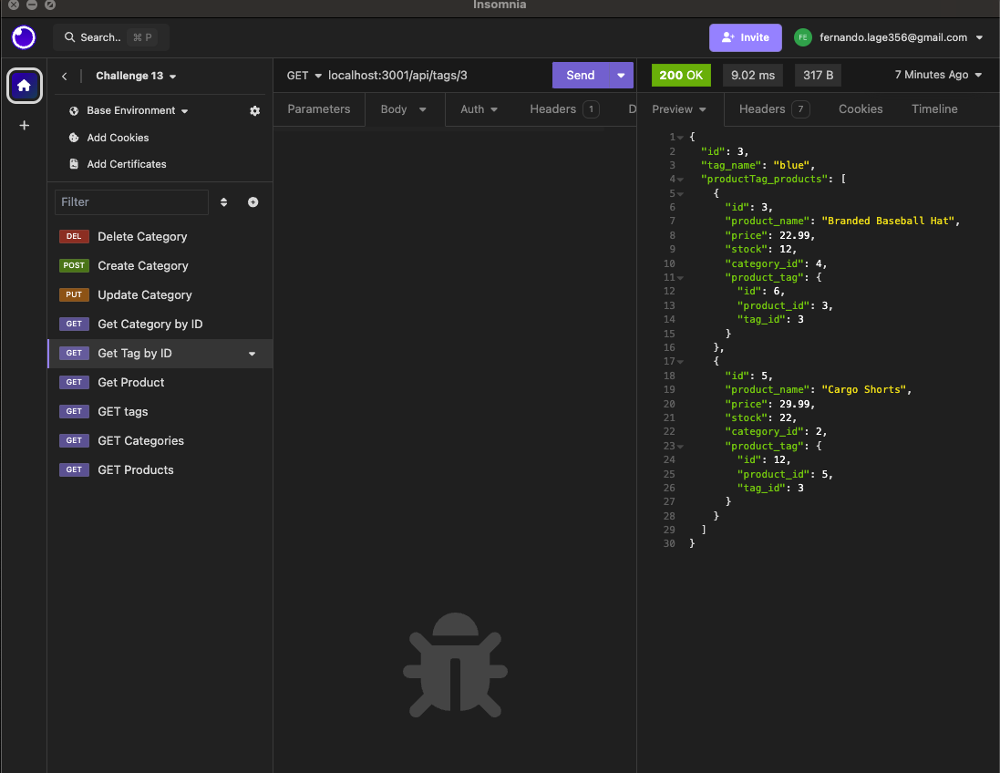

# sequilizing-database 
  
  - [License](#license)

  ## Description
   
  This project helps to manage an e-commerce database, this is a backend application that helps the user to  manage  products  by category and  by tag

  ## Table of Contents
  
  - [Installation](#installation)
  - [Usage](#usage)
  - [Credits](#credits)
  - [License](#license)
  
  ## Installation

  just run npm i to install all packages required

  ## Usage

  You will have to use insomia or postman to send requests to the server

  

  ## Credits
  
  Edx and Fernando Lage
  
  ## License
    MIT

  ## Features
  
  express.js Sequilize and MySQL
  
  ## Contact 
  https://github.com/lage356

  ## How to Contribute
  
  If you created an application or package and would like other developers to contribute it, you can include guidelines for how to do so. The [Contributor Covenant](https://www.contributor-covenant.org/) is an industry standard, but you can always write your own if you'd prefer.
  
  